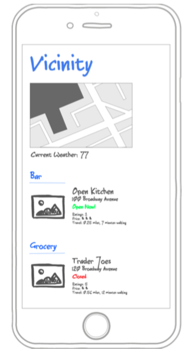

## Vicinity

### [Link to App hosted on Heroku](https://vicinity1.herokuapp.com/)

### Summary
When traveling to a new area, Vicinity will give you a quick glance of what's around you. Whether it's the nearest bar or park, Vicinity will show you.

### User stories
  * User will be able to view a list of categories
  * For each category, the user will be able to see the name, address, whether it's currently open, ratings, price level, picture, and travel time
  * User will be able to do a quick search query (using Google's search functionality)
  * User will be able to see a map of where they are
  * Under each travel time, user will be able to click a link to get map directions
  * User will be able to view the weather for their location
  * User may be able to log in and save their locations. They will still be able to use the application without logging in
  * The list of categories include:
    * Bar
    * Cafe
    * Casino
    * Convenience Store
    * Liquor Store
    * Museum
    * Park
    * Restaurant
    * Shopping Mall
    * Points of Interest

### APIs
  * ``/places/find`` get place information, including:
    * name
    * address
    * open_now
    * rating
    * price_level
    * picture_ref
    * link
    * latitude and longitude
  * ``/duration`` get travel information, including:
    * duration
    * distance

### Wireframes

